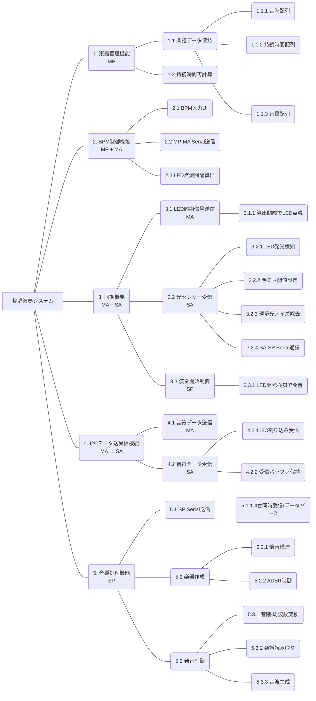

```mermaid
graph LR
%% 全体のルート
ROOT[輪唱演奏システム]---M1(1. 楽譜管理機能<br/>MP)
ROOT---M2(2. BPM制御機能<br/>MP + MA)
ROOT---M3(3. 同期機能<br/>MA + SA)
ROOT---M4(4. I2Cデータ送受信機能<br/>MA ↔ SA)
ROOT---M5(5. 音響処理機能<br/>SP)

%% 1. 楽譜管理機能
M1---1.1(1.1 楽譜データ保持)
1.1---1.1.1(1.1.1 音階配列)
1.1---1.1.2(1.1.2 持続時間配列)
1.1---1.1.3(1.1.3 音量配列)
M1---1.2(1.2 持続時間再計算)

%% 2. BPM制御機能
M2---2.1(2.1 BPM入力UI)
M2---2.2(2.2 MP-MA Serial送信)
M2---2.3(2.3 LED点滅間隔算出)

%% 3. 同期機能
M3---3.1(3.1 LED同期信号送信<br/>MA)
3.1---3.1.1(3.1.1 算出間隔でLED点滅)
M3---3.2(3.2 光センサー受信<br/>SA)
3.2---3.2.1(3.2.1 LED発光検知)
3.2---3.2.2(3.2.2 明るさ閾値設定)
3.2---3.2.3(3.2.3 環境光ノイズ除去)
3.2---3.2.4(3.2.4 SA-SP Serial通信)
M3---3.3(3.3 演奏開始制御<br/>SP)
3.3---3.3.1(3.3.1 LED発光検知で発音)

%% 4. I2Cデータ送受信機能
M4---4.1(4.1 音符データ送信<br/>MA)
M4---4.2(4.2 音符データ受信<br/>SA)
4.2---4.2.1(4.2.1 I2C割り込み受信)
4.2---4.2.2(4.2.2 受信バッファ保持)

%% 5. 音響処理機能
M5---5.1(5.1 SP Serial送信)
5.1---5.1.1(5.1.1 4台同時受信/データパース)
M5---5.2(5.2 楽器作成)
5.2---5.2.1(5.2.1 倍音構造)
5.2---5.2.2(5.2.2 ADSR制御)
M5---5.3(5.3 発音制御)
5.3---5.3.1(5.3.1 音階-周波数変換)
5.3---5.3.2(5.3.2 楽譜読み取り)
5.3---5.3.3(5.3.3 音波生成)

```